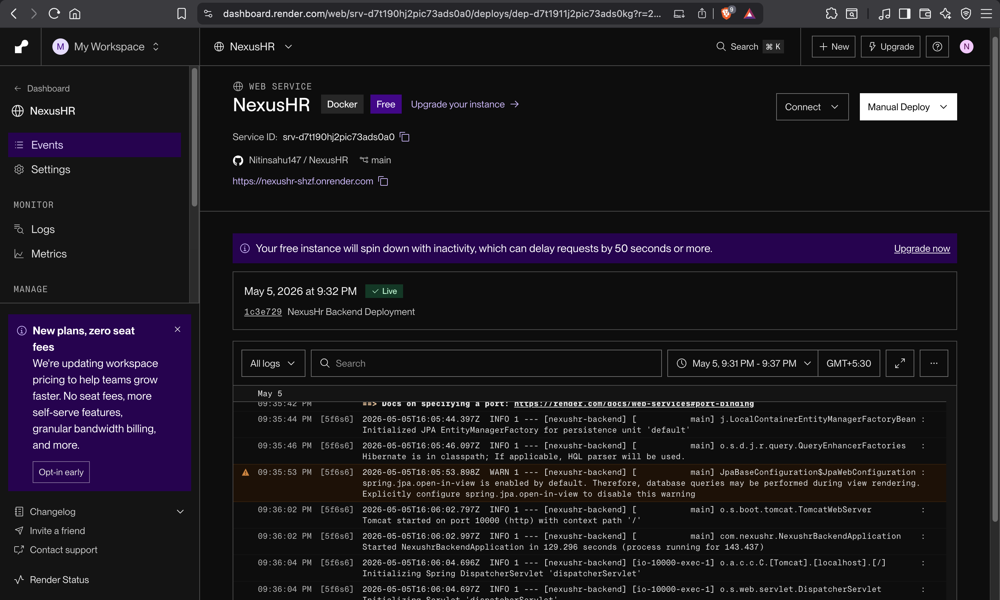
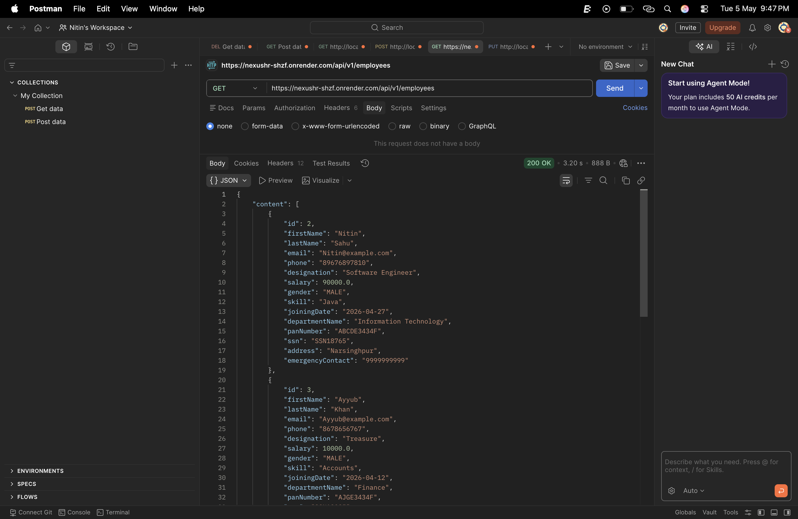
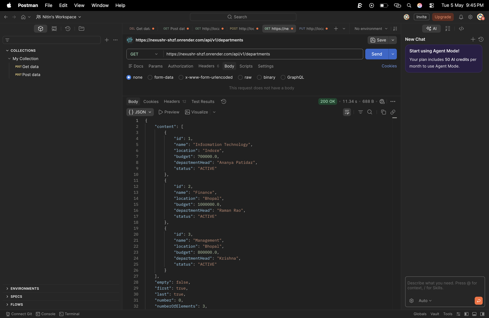
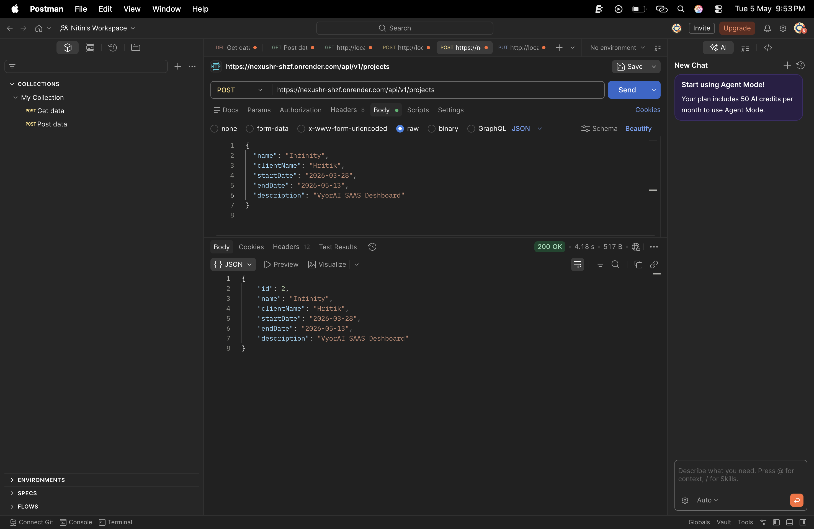
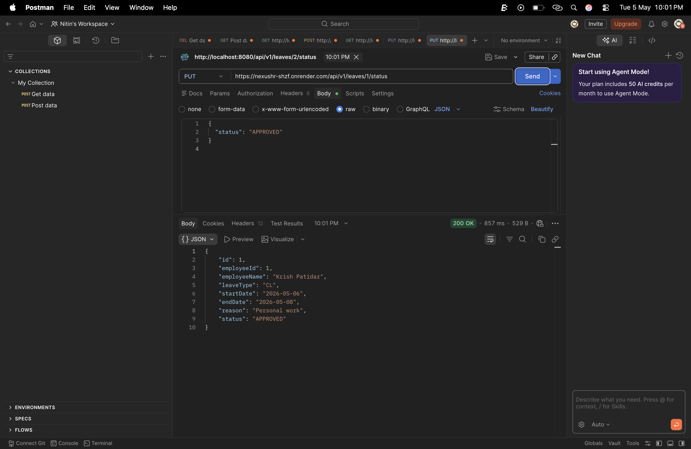

# 🧩 NexusHR – Smart Employee Management Platform

NexusHR is a full-stack Employee Management System that handles the complete employee lifecycle—from onboarding and department management to project assignment and leave tracking.

This project is built to simulate a real-world HR system using modern backend and frontend technologies.

---

## 🌐 Live Demo

- 🔗 Backend: https://nexushr-shzf.onrender.com 
- 🔗 Frontend: https://your-frontend-url.vercel.app  

---

## 🖼️ Screenshots

### 📊 Dashboard


### 👨‍💼 Employee Management


### 🏢 Department Module


### 📁 Project Management


### 📝 Leave System


---

## ⚙️ Features

### 👨‍💼 Employee Management
- Add and manage employees
- Search by name, skill, and department
- Transfer employees across departments
- Promote employees (designation + salary)
- Track leave balances

### 🏢 Department Management
- Create and update departments
- Department analytics (employee count, salary, gender ratio)
- Bulk salary raise (transaction safe)
- Deactivate department with validation

### 📊 Project Management
- Create and manage projects
- Assign employees with roles
- Remove employees from projects
- Track milestones and backlog

### 📝 Leave Management
- Apply for leave
- Approve or reject leave requests
- Automatic leave balance calculation

---

## 🏗️ Tech Stack

### Backend
- Java
- Spring Boot
- Spring Data JPA
- Hibernate
- PostgreSQL (Neon DB)
- Bean Validation
- REST APIs

### Frontend
- React.js (Vite)
- Axios
- React Router DOM

### Deployment
- Backend: Render
- Database: Neon
- Frontend: Vercel

---

## 🔗 Entity Relationships

- One-to-One → Employee ↔ Profile  
- Many-to-One → Employee → Department  
- Many-to-Many → Employee ↔ Project  
- One-to-Many → Employee → LeaveRequest  
- One-to-Many → Project → Milestones  

---

## 📡 API Overview

### Employee APIs
- POST `/api/v1/employees` → Create employee  
- GET `/api/v1/employees` → Get employees  
- GET `/api/v1/employees/search` → Search employees  
- PUT `/api/v1/employees/{id}/transfer` → Transfer employee  
- PUT `/api/v1/employees/{id}/promotion` → Promote employee  

### Department APIs
- POST `/api/v1/departments` → Create department  
- GET `/api/v1/departments` → Get departments  
- GET `/api/v1/departments/{id}/stats` → Analytics  
- PUT `/api/v1/departments/{id}` → Update department  
- PUT `/api/v1/departments/{id}/raise` → Bulk salary raise  
- DELETE `/api/v1/departments/{id}` → Deactivate  

### Project APIs
- POST `/api/v1/projects` → Create project  
- POST `/api/v1/projects/{id}/assign` → Assign team  
- DELETE `/api/v1/projects/{id}/employees/{empId}` → Remove employee  
- GET `/api/v1/projects/{id}/backlog` → View milestones  

### Leave APIs
- POST `/api/v1/leaves/request` → Apply leave  
- PUT `/api/v1/leaves/{id}/status` → Approve/Reject  

---

## 🧪 Sample Request

```json
{
  "firstName": "Nitin",
  "lastName": "Sahu",
  "email": "nitin@example.com",
  "designation": "Software Engineer Intern",
  "salary": 90000,
  "departmentId": 1
}
```

---

## 🧠 Concepts Used

- Layered Architecture (Controller → Service → Repository)
- DTO Pattern for clean data transfer
- JPA Relationships (One-to-One, One-to-Many, Many-to-Many)
- Specification API for dynamic filtering & search
- Pagination & sorting for scalable data handling
- Transaction management for critical operations
- Global exception handling
- RESTful API design principles

---

## 📈 Learning Outcomes

Through building NexusHR, I gained practical experience in:

- Designing scalable backend systems using Spring Boot
- Structuring real-world REST APIs with proper layering
- Managing complex entity relationships using JPA & Hibernate
- Integrating frontend (React) with backend APIs
- Handling validation, error responses, and edge cases
- Implementing pagination and dynamic search functionality
- Deploying full-stack applications (Render + Neon DB)

This project helped me move from learning concepts to actually building a production-like system.

---

## 👤 Author

**Nitin Sahu**  
- 📧 Email: nitinsahu147@gmail.com  
- 💼 LinkedIn: https://www.linkedin.com/in/nitinsahu147 
- 🐙 GitHub: https://github.com/nitinsahu147
